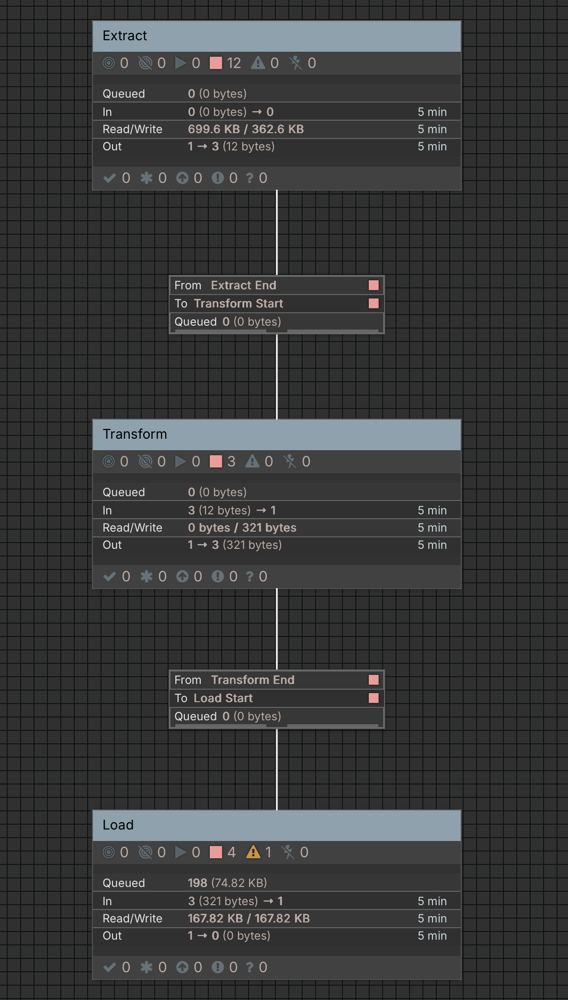
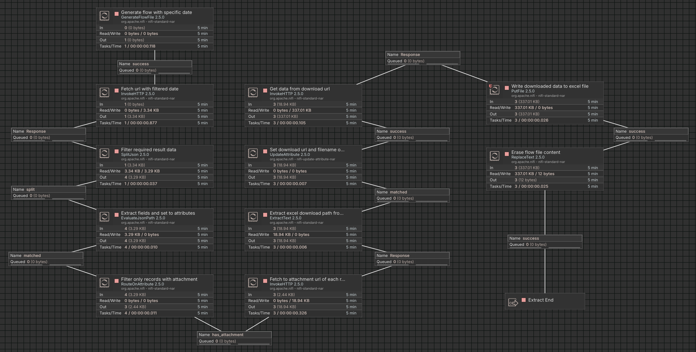
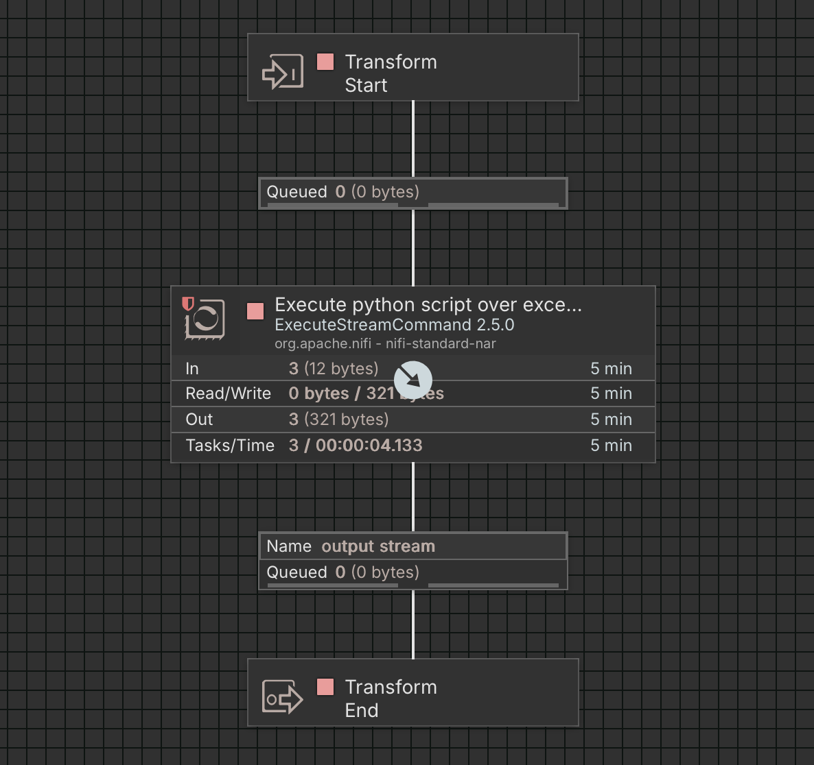
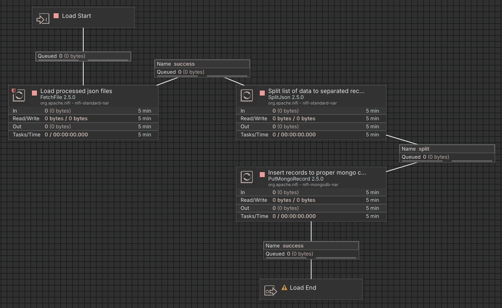

## Project Setup and NiFi Flow Execution

Follow these steps to set up the project and run the NiFi data flow.

### 1. Clone the Project

```bash
git clone https://github.com/mohsenklntri/charisma-code-challenge.git
cd charisma-code-challenge/task-2
```


### 2. Configure Environment Variables
Create a copy of the sample environment file:

```bash
cp .env.sample .env
```
Open `.env` and fill in all required values, including credentials and database connection details.

### 3. Start the Services
Build and start all services using Docker Compose:

```bash
docker compose up --build
```

### 4. Access NiFi GUI
Once the services are up, open the NiFi web interface at:

```arduino
http://localhost:8443
```
Login using the username and password you set in the `.env` file.


### 5. Import and Configure the NiFi Flow
##### 1- Create a new Process Group in NiFi.
##### 2- Import the flow from:

```bash
task-2/nifi/NiFi_Flow.json
```
##### 3- Update the Parameter Context:
##### - Set the `mongo_pass` value.

##### - Update any other variables required for MongoDB connections according to your `.env` file.
##### - Enable all controller services of Load Process Group.

⚠️ Make sure every variable used in the flow matches your environment configuration.

### 6. Run the Flow
After configuring the parameters, start the flow.
Processed records will be stored in the three collections in MongoDB.


#
## NiFi Flow and Process Overview

Images of the main flow and its processes are available in the repository:

- Each image corresponds to a section of the NiFi flow.
- Use these images as a reference when reviewing or debugging the flow.
- They show the arrangement of **process groups**, **processors**, and connections.

> This can help you quickly understand the flow without opening NiFi GUI.

- NiFi Flow


- Extract process group


- Transform process group


- Load process group


--
## Project Summary

The NiFi flow is implemented as follows:

1. **Data Generation and Request**  
   The flow starts by generating a sample date (`1404/10/14`) and initiating the process.  
   It then sends a request to the corresponding URL on `codal.ir` and receives a response containing records.

2. **Data Processing and Excel Download**  
   The response data is processed, and the download link for the Excel attachment in these records is extracted.  
   The Excel file is then downloaded and saved locally using its symbol name.

3. **Python Script Processing**  
   A Python script is executed on the downloaded Excel files to process the data.  
   The results of each file are saved in JSON format, using the original file name(symbol name).  
   > Note: These Python scripts can also be executed locally, outside of NiFi.

4. **Final Storage in MongoDB**  
   In the last step, each JSON file (representing a single symbol) is read, and all its records are stored in a MongoDB collection named matched to symbol name.

### Why MongoDB is Used

>> MongoDB is used to store the results. The main reason for this choice is the irregular and varied structure of the output data from the Excel files.  
Since processing the Excel files was somewhat challenging and the results did not have a consistent structure, MongoDB provides flexible storage without the need for rigid table definitions.  
This way, each JSON file representing a specific symbol can be easily stored in a separate collection, and all its records can be kept without any structural issues.
