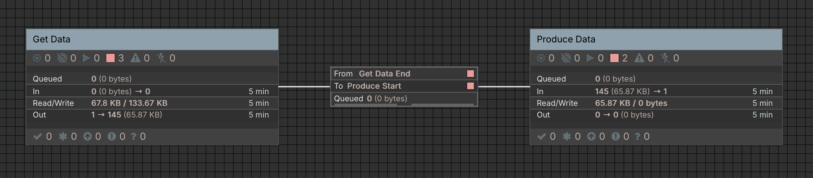
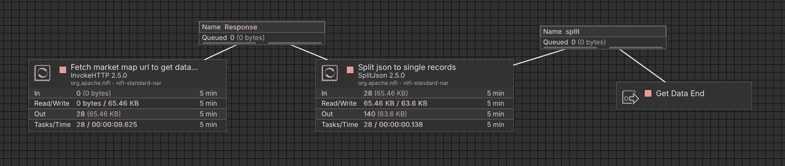
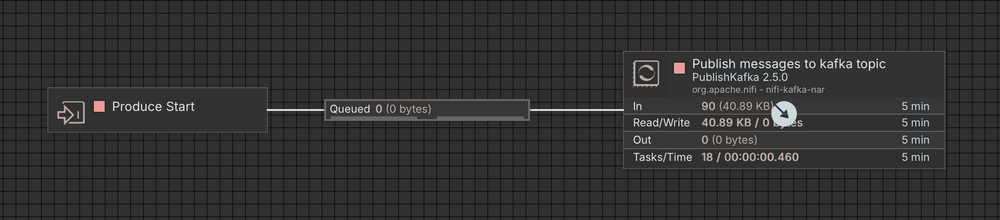

## Project Setup and NiFi Flow Execution

Follow these steps to set up the project and run the NiFi data flow.

### 1. Clone the Project

```bash
git clone https://github.com/mohsenklntri/charisma-code-challenge.git
cd charisma-code-challenge/task-1
```


### 2. Configure Environment Variables
Create a copy of the sample environment file:

```bash
cp .env.sample .env
```
Open `.env` and fill in all required values, including credentials and database connection details.

### 3. Start the Services
Build and start all services using Docker Compose:

```bash
docker compose up
```

### 4. Access NiFi GUI
Once the services are up, open the NiFi web interface at:

```arduino
http://localhost:8443
```
Login using the username and password you set in the `.env` file.


### 5. Import and Configure the NiFi Flow
##### 1- Create a new Process Group in NiFi.
##### 2- Import the flow from:

```bash
task-1/data/nifi/NiFi_Flow.json
```
##### 3- Update the Parameter Context:
##### - Enable all controller services of Load Process Group.

⚠️ Make sure every variable used in the flow matches your environment configuration.

### 6. Run the Flow
After configuring the parameters, start the flow.
Processed records will be stored in `'market_map'` topic of kafka every seconds.


#
## NiFi Flow and Process Overview

Images of the main flow and its processes are available in the repository:

- Each image corresponds to a section of the NiFi flow.
- Use these images as a reference when reviewing or debugging the flow.
- They show the arrangement of **process groups**, **processors**, and connections.

> This can help you quickly understand the flow without opening NiFi GUI.

- NiFi Flow


- Get Data process group


- Transform process group


--
## NiFi Flow Overview - Market Data Pipeline

The NiFi flow is implemented as follows:

Get Data Process Group: Makes API requests every second → receives JSON arrays → splits into individual JSON records.

Produce Data Process Group: Takes split records → publishes to Kafka topic "market_map".

>Make sure Kafka service is running, create a virtualenv, install requirements from task-1/requirements.txt, and run `market_data_pipeline.py` with valid API arguments to simulate the entire NiFi flow using Python.